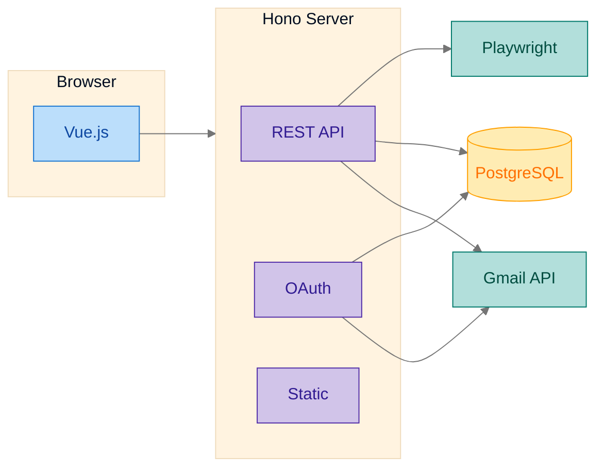
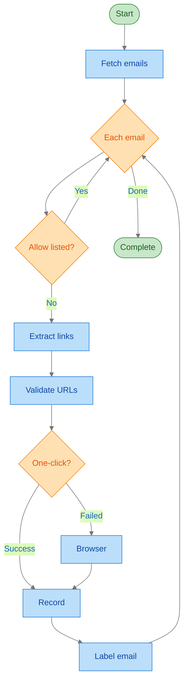
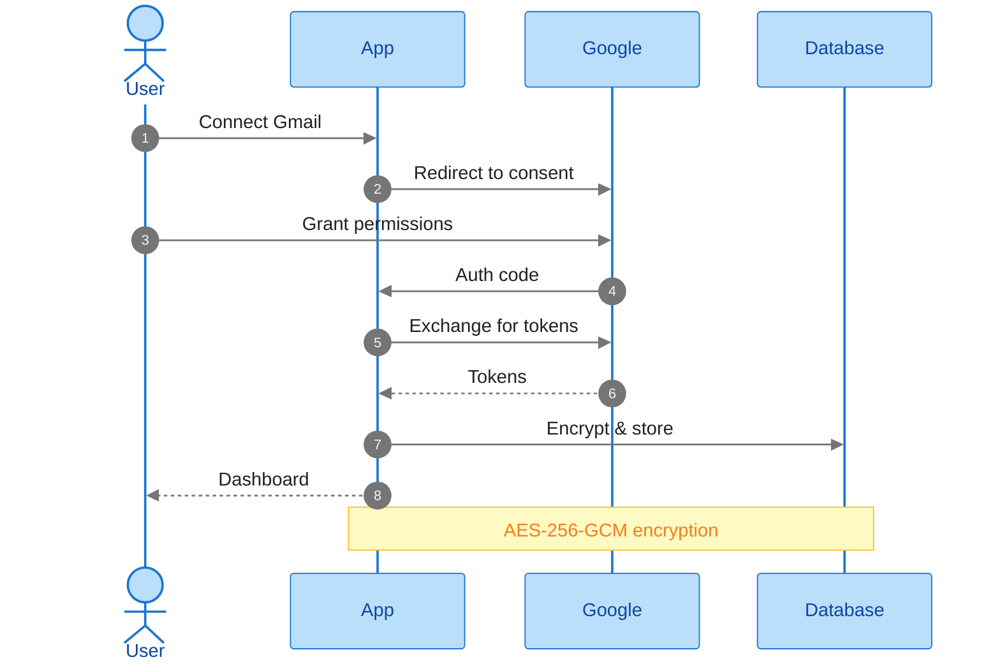
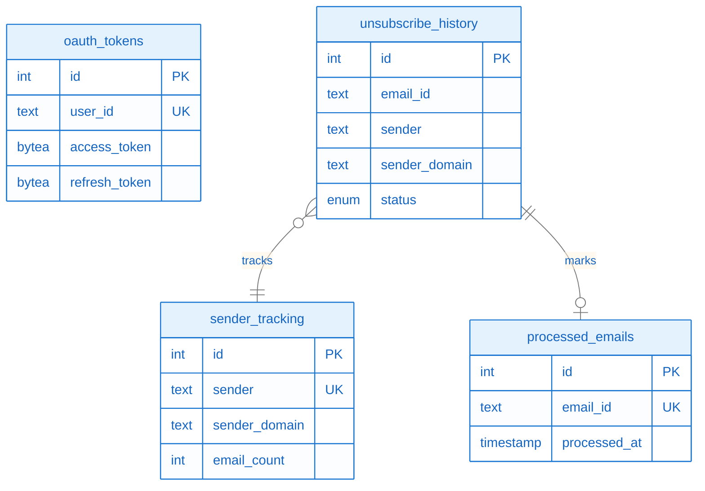

# Architecture Overview

This document describes the architecture of the Email Unsubscribe application.

## System Overview

## Core Components

### 1. Gmail Integration (`src/gmail/`)

- **OAuth Flow**: Handles Google OAuth 2.0 authentication
- **Token Management**: Encrypts and stores refresh tokens
- **API Client**: Interfaces with Gmail API for reading emails
- **Labels**: Manages Gmail labels for tracking processed emails

### 2. Email Scanner (`src/scanner/`)

- **Header Parser**: Extracts `List-Unsubscribe` headers (RFC 8058)
- **HTML Parser**: Finds unsubscribe links in email body
- **Allow List**: Manages senders to preserve
- **Sender Tracking**: Tracks effectiveness of unsubscribes

### 3. Unsubscribe Processor (`src/unsubscribe/`)

- **URL Validator**: Validates URLs, prevents SSRF attacks
- **One-Click Handler**: Processes RFC 8058 POST requests
- **Mailto Handler**: Sends unsubscribe emails
- **Browser Automation**: Uses Playwright for complex flows
- **Pattern Manager**: Stores reusable automation patterns

### 4. Tracking System (`src/tracker/`)

- **Attempt Tracker**: Records all unsubscribe attempts
- **Audit Logger**: Logs all actions for debugging
- **Statistics**: Aggregates success/failure metrics

### 5. Web Dashboard (`src/api/`, `src/public/`)

- **REST API**: JSON endpoints for dashboard operations
- **Vue.js SPA**: Single-page application dashboard
- **Real-time Stats**: Overview of processing status

## Data Flow

### Email Processing Flow

### Authentication Flow

## Database Schema

The application uses a dedicated `email_unsubscribe` schema in PostgreSQL:

### Core Tables

| Table                 | Purpose                        |
| --------------------- | ------------------------------ |
| `oauth_tokens`        | Encrypted OAuth refresh tokens |
| `allow_list`          | Senders to preserve            |
| `unsubscribe_history` | All unsubscribe attempts       |
| `sender_tracking`     | Per-sender statistics          |
| `processed_emails`    | Emails already processed       |
| `audit_log`           | Action audit trail             |
| `patterns`            | Reusable automation patterns   |
| `scan_state`          | Scan pagination state          |

### Key Relationships

## Security Considerations

### SSRF Prevention

All URLs are validated before processing:

- Block private IP ranges (10.x, 192.168.x, etc.)
- Block localhost and 127.x addresses
- Only allow HTTP/HTTPS protocols
- Domain validation

### Token Security

- OAuth tokens encrypted with AES-256-GCM
- Encryption key from environment variable
- Tokens stored encrypted at rest

### Authentication

- Auth delegated to main domain (cddc39.tech)
- Session cookies shared across subdomain
- CSRF protection on state-changing endpoints

### Browser Isolation

- Playwright runs in headless mode
- Separate browser context per domain
- Screenshots/traces stored locally

## Performance Characteristics

### Rate Limits

| Operation          | Limit                  | Reason               |
| ------------------ | ---------------------- | -------------------- |
| Gmail API          | 250 quota units/second | Google quota         |
| One-click requests | 10/minute              | Avoid rate limiting  |
| Browser automation | 1 concurrent           | Resource constraints |

### Resource Usage

| Component  | CPU  | Memory  | Notes                |
| ---------- | ---- | ------- | -------------------- |
| Web server | Low  | ~50 MB  | Deno is lightweight  |
| Playwright | High | ~200 MB | Per browser instance |
| PostgreSQL | Low  | Varies  | Shared instance      |

## Error Handling

### Failure Categories

1. **Network errors**: Timeout, connection refused
2. **Authentication errors**: Invalid tokens, expired
3. **Automation failures**: Element not found, unexpected flow
4. **Rate limiting**: Too many requests

### Recovery Strategies

- Automatic token refresh on expiry
- Retry with exponential backoff
- Screenshot capture on browser failures
- Playwright trace for debugging complex flows

## Extensibility

### Adding New Unsubscribe Patterns

1. Navigate to failed attempts in dashboard
2. Analyze the screenshot/trace
3. Create a pattern with CSS selectors
4. Pattern automatically applies to similar domains

### Custom Allow List Rules

Support patterns:

- `example.com` - Match domain
- `*.example.com` - Match subdomains
- `user@example.com` - Match exact sender
- `*billing*` - Match partial patterns
